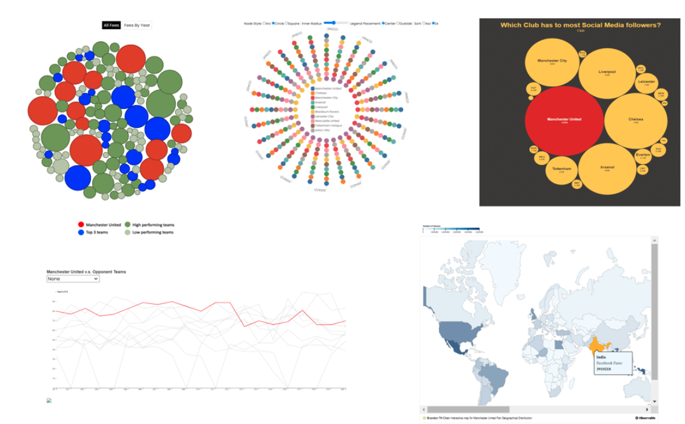

# 6.859 - Interactive Data Visualization 
## **Final Project** ###

### **Project Title:** 360 Degrees Analysis on the Most Beloved Football Club in English Premier League: Manchester United

#### **Visualization Link:** https://6859-sp21.github.io/final-project-epl-fans/index.html

#### **Video link:** https://youtu.be/4JlkE2x6xQs

#### **Paper Link:** https://github.com/6859-sp21/final-project-epl-fans/blob/master/FinalPaper.pdf

### **Team:**
* Brandon Chen (brandonc@mit.edu)
* ByeongJo Kong (kongb@mit.edu)

### **Abstract:**
Manchester United is considered the most popular soccer club in the world. Its worldwide fan base reaches a 1.1 billion milestone in 2019. There are several reasons that make Manchester United so popular. Firstly, its team performance is among the top tier in the league. It has won 20 League titles, 12 FA Cups, five League Cups and a record 21 FA Community Shields. 

Secondly, Manchester United has successfully created individual wonder players over several generations. For example, Best, Beckham, and Ronaldo. Fans support not only the club but these players too. Thirdly, Manchester United has a long and last relationship with non-European countries. It often tours to Asia countries and the United States, interacting with existing fans and attracting new ones.

### **Summary Image:**
 
  

### **Running Instruction:**
Use browser to access : https://6859-sp21.github.io/final-project-epl-fans/index.html
 

### **Development Process:**
***Overview***  
In the first meeting, we decided the topic for doing a project with English Premier League data. The reason is that both of us are big fans of soccer games. We decided to leverage the knowledge we have in A4 and use D3 and Javascript as our main tool.
 
### **~6 weeks of concerted efforts**
#### **1st Week**
Both started to explore the different datasets. After the first week, we decided to make visualizations for three different directions, Player Static, Team Performance, and Social Media Analysis. ( Both of us spent around 8 hours this week ) 
#### **2nd Week**
We received feedback from the Professor and decided to spend one more week to brainstorm the idea. We went to the office hours and explored more datasets. ( Both of us spent 8 hours this week )
#### **3rd Week**
From our data, we decided the scope of visualizations, a bubble chart for transfer fee, a radar chart for team performance, a line chart for attack points, bubble chart for social media number comparison and a map chart for social media followers . ( Both of us spent 8 hours this week )
#### **4th Week**
- Jo : Bubble chart for transfer fee  ( ~ 12 hours )
Brandon : Map chart for social media follower have completed ( ~ 12 hours ) 
#### **5th Week**
- Jo : Radar chart for team performance was completed ( ~ 12 hours )
- Brandon : Line chart for attacking point was completed ( ~ 12 hours )
#### **6th Week**
- Jo : bubble chart for social media number comparison and Integrate the website ( ~ 24 hours )
- Brandon : Fine tune the map chart and line chart and prepare the write up ( ~ 24 hours ) 
#### **Total Effort**
- ByeongJo ( ~ 72 hours )
- Brandon ( ~ 72 hours )
